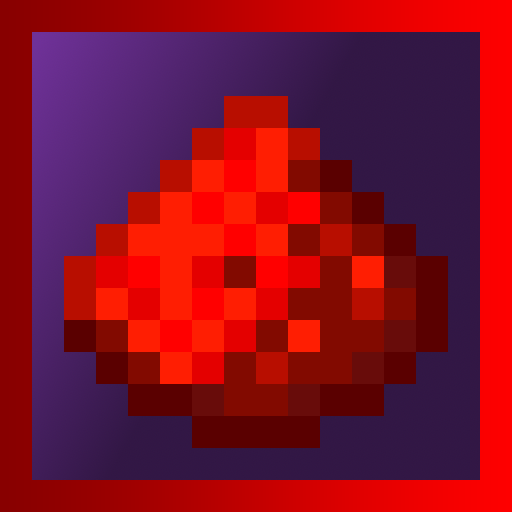

    
    <h1>Circuitman</h1>
    
Unleash your inner computer nerd (and chaotic self)

---

If you found this, you may be desperate for **better redstone**. Don't get me wrong, vanilla redstone is definitely capable. But what if it was extended to be more realistic and chaotic? That—is the question **Circuitman** solves.

**Features**

We're always adding new features just waiting to be abused! Of course, some may be missing. If you believe there's more, I would recommend inspecting the code itself.
- **Flammable redstone** — Ever tried lighting redstone dust? Don't do it now! When you use flint-and-steel next to redstone wire, it causes a chain reaction of burning wire. If it touches TNT—you're toast. And not just the vanilla TNT behavior, it's a **GIANT** fire crater!
- **More to come** — If this doesn't seem like a lot—you're right. We have ideas, but we're not **that** fast!

**Contributing**

Found a bug/glitch? Report it in the GitHub! Don't appreciate our current feature set? Submit a pull request or fork the repository! Point is, we appreciate contributors. Just be sure to follow our [MIT license](LICENSE.md), please!

After making important changes in the plugin, you are **totally** allowed to add yourself as an author in the [paper-plugin.yml](src/main/resources/paper-plugin.yml). Just—don't add your name if it's not that big of a change! We don't like credit hogs.